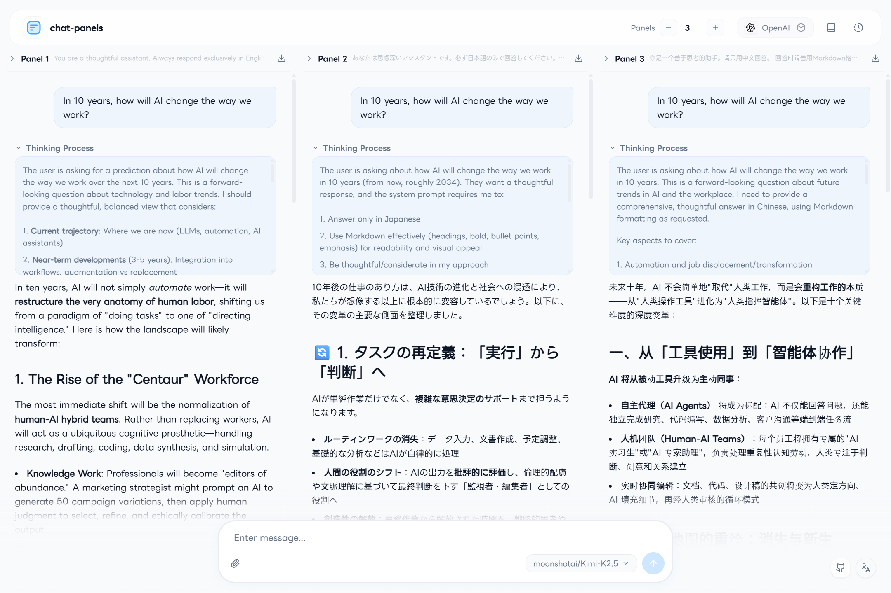
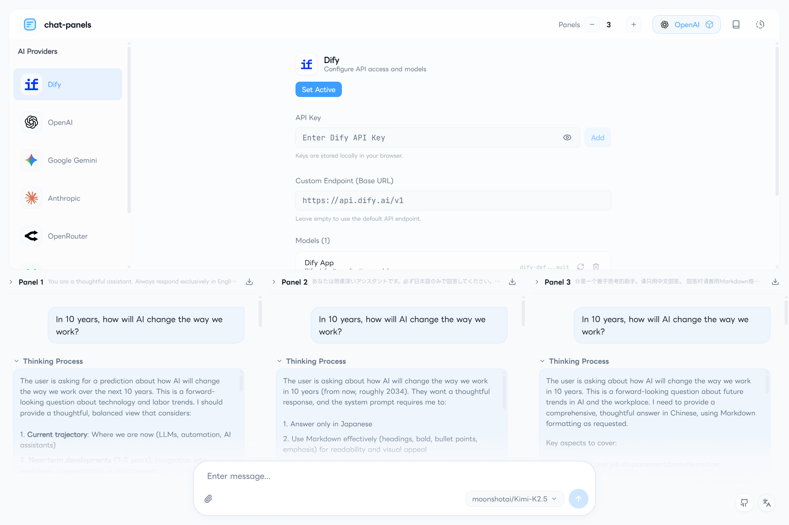
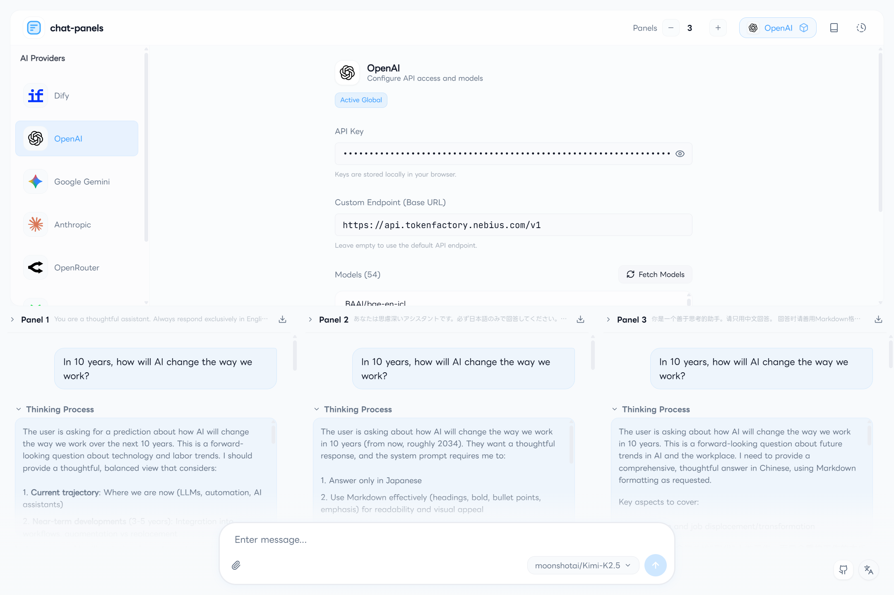

# Chat Panels

**Minimal multi-pane AI playground** — Compare and interact with multiple AI models side by side in your browser.

[](https://chat-panels.pages.dev)
[](https://vercel.com/new/clone?repository-url=https://github.com/lnkiai/chat-panels)



## ✨ Features

- **Multi-panel layout** — Open up to 4 AI conversations side by side
- **Multiple AI providers** — Dify, OpenAI, Anthropic, Gemini, OpenRouter, Longcat AI, and more
- **Zero server-side storage** — All settings and chat history are stored locally in your browser
- **Streaming responses** — Real-time streaming for all supported providers
- **System prompt management** — Per-panel system prompts with template support
- **Dify integration** — Full support for Dify Chat App API, including file uploads and suggested questions
- **i18n support** — English and Japanese UI
- **Responsive** — Works on desktop and mobile (swipe between panels)
- **Edge Runtime** — Deployable to Cloudflare Pages and Vercel Edge Network

### Dify Setup



### OpenAI-compatible Endpoints

> Works with any OpenAI-compatible API — including [Nebius AI](https://nebius.com/), [Together AI](https://www.together.ai/), [Groq](https://groq.com/), and more.



## 🚀 Deploy

### Option A: Vercel (Easiest)

1. Click the **Deploy with Vercel** button above, or fork this repository and import it on [Vercel](https://vercel.com/new)
2. Use the default settings (Next.js is auto-detected)
3. Click **Deploy**

### Option B: Cloudflare Pages

1. Fork this repository
2. Go to [Cloudflare Dashboard](https://dash.cloudflare.com/) → **Workers & Pages** → **Create** → **Pages** → **Connect to Git**
3. Select your forked repository
4. Set the following build settings:

   | Setting | Value |
   |---------|-------|
   | **Framework preset** | `None` |
   | **Build command** | `npm run pages:build` |
   | **Build output directory** | `.vercel/output/static` |

5. Add environment variables (under **Settings → Environment variables**):

   | Variable | Value |
   |----------|-------|
   | `NODE_VERSION` | `20.19.0` |

6. Click **Save and Deploy**

> **Note**: No API keys are required as environment variables — users enter their own keys in the browser UI.

### Option C: Run Locally

```bash
# Clone the repository
git clone https://github.com/lnkiai/chat-panels.git
cd chat-panels

# Install dependencies
npm install

# Start development server
npm run dev
```

Open [http://localhost:3000](http://localhost:3000) in your browser.

## 🔑 Supported AI Providers

| Provider | Notes |
|------------|-------|
| **Dify** | Full Chat App API support (streaming, file upload, suggested questions) |
| **OpenAI** | GPT-4o, o3-mini, GPT-5, and more |
| **Anthropic** | Claude Sonnet 4.6, Claude Opus 4.6, Haiku 4.5, and more |
| **Google Gemini** | Gemini 2.5 Pro, Gemini 2.5 Flash, and more |
| **OpenRouter** | Access 400+ models through a single API |
| **Longcat AI** | High-speed, long-context models |
| **OpenAI-compatible** | Any custom endpoint — Nebius, Together AI, Groq, Ollama, and more |

> Each provider requires its own API key, which is stored only in your browser's local storage.

## 🛠️ Tech Stack

- **Framework**: [Next.js 16](https://nextjs.org/) (App Router)
- **Runtime**: React 19
- **Language**: TypeScript
- **Styling**: Tailwind CSS
- **UI Components**: [shadcn/ui](https://ui.shadcn.com/) + Radix UI
- **Animations**: Framer Motion
- **Deployment**: Cloudflare Pages (`@cloudflare/next-on-pages`)

## 📁 Project Structure

```
chat-panels/
├── app/
│   ├── api/
│   │   ├── chat/         # Main chat proxy (Edge Runtime)
│   │   ├── models/       # Fetch available models from providers
│   │   └── dify/         # Dify-specific endpoints (upload, feedback, etc.)
│   ├── layout.tsx
│   └── page.tsx          # Main playground page
├── components/           # UI components (HeaderBar, ChatPanel, MessageInput...)
├── hooks/                # React hooks (usePlayground, useTemplates...)
├── lib/
│   ├── ai-providers/     # Provider definitions and implementations
│   └── i18n/             # Internationalization (EN/JA)
└── public/               # Static assets (fonts, icons, OG image)
```

## ⚙️ Configuration

All configuration is done through the in-app settings UI. No `.env` file is required for basic usage.

The app stores the following in `localStorage`:
- API keys (per provider)
- Panel layout and titles
- System prompts
- Prompt templates
- Chat history

## 🔒 Privacy & Security

- **No data is sent to any server operated by this project.** All API calls go directly from your browser to the AI provider's API (via the Edge Runtime proxy).
- API keys are stored only in your browser's `localStorage`. They are never logged or persisted on any server.
- The Edge Runtime proxy (`/api/chat`) forwards your request to the AI provider and streams the response back. It does not store any data.

## 🤝 Contributing

Contributions are welcome! Please open an issue first to discuss what you'd like to change.

1. Fork the repository
2. Create a feature branch (`git checkout -b feature/your-feature`)
3. Commit your changes (`git commit -m 'Add some feature'`)
4. Push to the branch (`git push origin feature/your-feature`)
5. Open a Pull Request

## 📄 License

[MIT](LICENSE) © Chat Panels Contributors

Third-party licenses (fonts, UI components, npm packages): [THIRD_PARTY_LICENSES.md](THIRD_PARTY_LICENSES.md)
